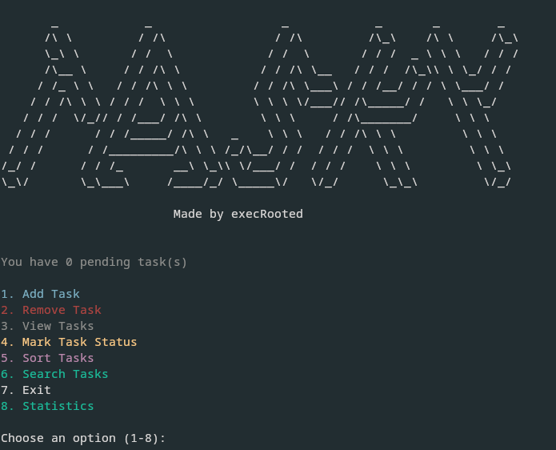

# 📝 Tasky 

**Tasky** is a colorful, terminal-based to-do manager written in C# for Arch Linux.  
It helps you manage tasks with priorities and categories.

> Built for Arch Linux, but should work on most Linux distros with .NET support.
---


---

## ✨ Features
- 🎨 **Colored UI** — priorities and statuses are color-coded for easy reading  
- 📅 **Due dates & reminders** — get alerts for upcoming tasks  
- 📊 **Statistics** — track your productivity score and task breakdown  
- 📂 **Categories & priorities** — organize tasks effectively  
- 🔍 **Search & filter** — find tasks quickly  
- 🔔 **Sound notifications** — optional task reminder sounds using `mpv`

---

## 📦 Dependencies
Tasky requires:
- **dotnet-sdk** (to build/run C#)
- **mpv** (to play `.mp3`/`.wav` reminder sounds)
- **ffmpeg** (optional, adds more sound format support)
- **Newtonsoft.Json** (installed automatically by the script)

---

## 🚀 Installation
Clone the repository and run the install script:


    git clone https://github.com/execRooted/Tasky.git

```
cd tasky
```
```
chmod +x install_tasky.sh
```
```
./install_tasky.sh
```


***The installer will:***

- Install required dependencies
- Create a .NET project if missing
- Copy the program source
- Add Newtonsoft.Json automatically
- Build a self-contained single-file executable
- Install it to ~/.local/bin/tasky
- Add ~/.local/bin to your PATH (if missing)


---


<h3>Once installed, simply run:</h3>

```
tasky 
```
No matter where you are in your terminal, Tasky will start.
Tasks are saved in the same directory as the executable unless configured otherwise.

---


<h2>❌ Uninstallation</h2>

**To completely remove Tasky, run these commands in the project directory:**

```
chmod +x uninstall_tasky.sh
```
```
./uninstall_tasky.sh
```

The uninstaller will:

   - Remove the tasky binary from ~/.local/bin

   - Delete the local .NET project folder

   - Optionally remove ~/.local/bin from your PATH if empty
   
   ---
   
   <h3>💡 Notes</h3>

   -  Task data is stored in tasks.json in the working directory by default — you can change this to a fixed config path if desired.
