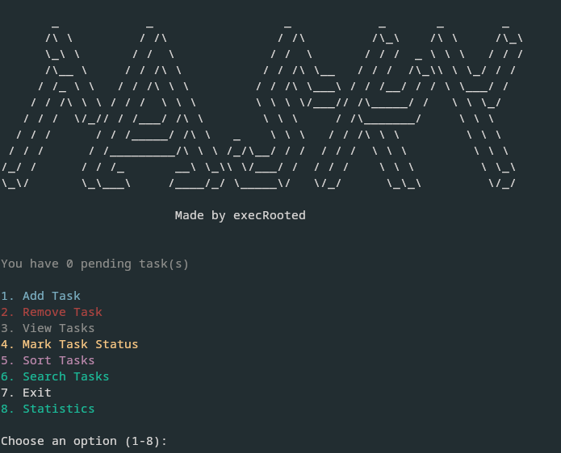

#  Tasky 

**Tasky** is a colorful, terminal-based to-do manager written in C# for Arch Linux.  
It helps you manage tasks with priorities and categories.

> Built for Arch Linux, with support for all major Linux distros.

---

If you found this project useful, buy me a coffee :)

[](https://buymeacoffee.com/execrooted)

---


---

##  Features
-  **Colored UI** — priorities and statuses are color-coded for easy reading  
-  **Due dates & reminders** — get alerts for upcoming tasks  
-  **Statistics** — track your productivity score and task breakdown  
-  **Categories & priorities** — organize tasks effectively  
-  **Search & filter** — find tasks quickly  
-  **Sound notifications** — optional task reminder sounds using `mpv`

---

##  Dependencies
Tasky requires:
- **dotnet-sdk** (to build/run C#)
- **mpv** (to play `.mp3`/`.wav` reminder sounds)
- **ffmpeg** (optional, adds more sound format support)
- **Newtonsoft.Json** (installed automatically by the script)

---

##  Installation
Clone the repository and run the install script:


    git clone https://github.com/execRooted/Tasky.git

```
cd Tasky
```
```
chmod +x installer.sh
```
```
./installer.sh
```


***The installer:***

- Focuses on system-wide installation (root required)

- Uses cross-system tools, depending on what distro it detected

 - Creates a dotnet DLL launcher rather than single-file binary

 - Adds optional desktop entry (GUI integration)

 - Installs mpv for sound notifications
   
---


<h3>Once installed, simply run:</h3>

```
sudo tasky 
```
No matter where you are in your terminal, Tasky will start.
Tasks are saved in the same directory as the executable unless configured otherwise.

---


<h2> Uninstallation</h2>

**To completely remove Tasky, run these commands in the project directory:**

```
chmod +x uninstaller.sh
```
```
./uninstaller.sh
```

The uninstaller will:

   - Remove the tasky binary from ~/.local/bin

   - Delete the local .NET project folder

   - Optionally remove ~/.local/bin from your PATH if empty

   - Delete the /var/lib/tasky directory created during instalation
   
   ---
   
   <h3> Notes</h3>

   -  Task data is stored in tasks.json in the /var/lib/tasky directory by default — you can change this to whatever you prefer. It was added there for global access.
